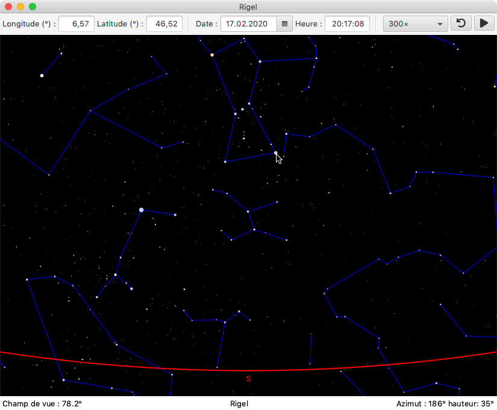

# Introduction 

The goal of this project, named Rigel in honor of one of the brightest stars, is to write a program to visualize the night sky.

The screenshot below shows what the program should look like when finished.
We see a representation of the sky such that a person on the [EPFL]("https://www.epfl.ch/en/") site on February 17, 2020 at 8:17 p.m. and looking south would see it, assuming the weather is mild.

The red line at the bottom of the screen represents the horizon, and the letter S placed below indicates the south. The cursor of the mouse is placed on the star [Rigel]("https://en.wikipedia.org/wiki/Rigel"), of the constellation [Orion]("https://en.wikipedia.org/wiki/Rigel"), which is at this moment at the azimuth 186 ° - almost due south - and 35 ° above the horizon, as indicated at the bottom right.
The blue lines link the stars together forming a number of [asterisms]("https://en.wikipedia.org/wiki/Asterism_(astronomy)"), such as that evoking a vertical bow tie to which Rigel belongs.

# Reference book

The project is based on the fourth edition of the book _Practical Astronomy with your Computer or Spreadsheet by Peter Duffett-Smith and Jonathan Zwart_,
from which all the formulas for astronomical calculation are extracted.

# Usage

To launch the program simply execute main.java file in folder src/rigel.